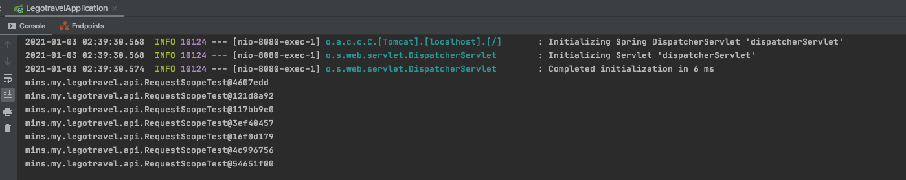
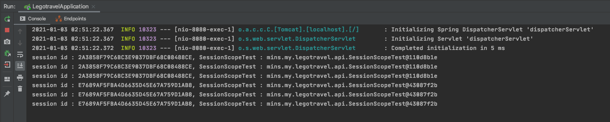
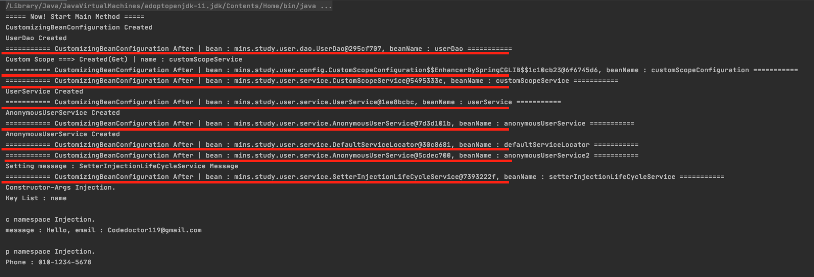
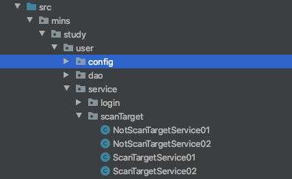
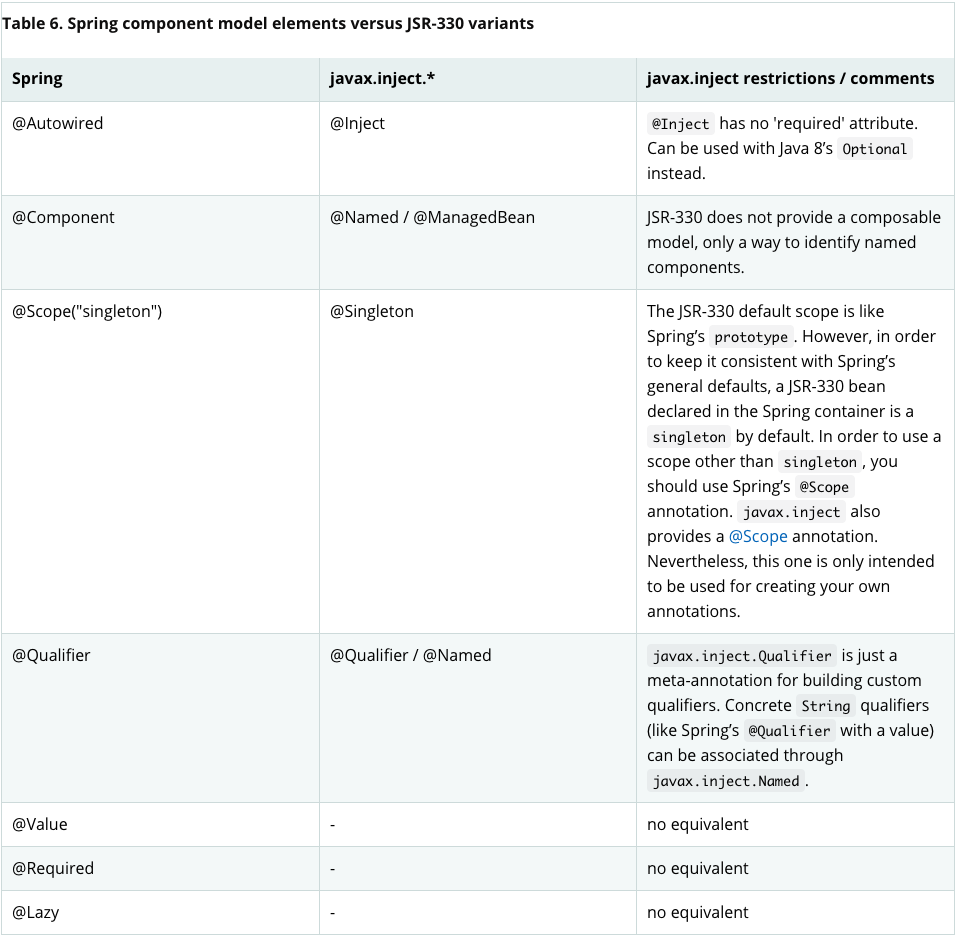

# Spring Core Study

- Reference Document
    1. https://docs.spring.io/spring-framework/docs/current/reference/html/core.html#beans
    
    
# About Web Scope
| Request Scope

```` 
@Controller
@RequestScope
@RequestMapping("/v1/api/beanScope")
@RequiredArgsConstructor
public class RequestScopeTest {

    private final ApplicationContext applicationContext;

    @GetMapping
    @ResponseBody
    public String test() {
        RequestScopeTest requestScopeTest = applicationContext.getBean("requestScopeTest", RequestScopeTest.class);
        System.out.println(requestScopeTest.toString());
        return "Request Scope";
    }
}
````
Console)




| Session Scope
````
@SessionScope
@RestController
@RequiredArgsConstructor
@RequestMapping("/v1/api/sessionScope")
public class SessionScopeTest {

    private final ApplicationContext applicationContext;

    @GetMapping
    public String test(HttpServletRequest request) {
        SessionScopeTest requestScopeTest = applicationContext.getBean("sessionScopeTest", SessionScopeTest.class);
        System.out.println("session id : " + request.getSession().getId() + ", SessionScopeTest : " + requestScopeTest.toString());
        return "Session Scope";
    }
}
````

Console)



//TODO Websocket Scope


| Application Scope

````
@ApplicationScope
@RestController
@RequiredArgsConstructor
@RequestMapping("/v1/api/applicationScope")
public class ApplicationScopeTest {

    private final ApplicationContext applicationContext;
    private static Integer counter = 0;

    private final WebApplicationContext webApplicationContext;

    @GetMapping
    public String test() {
        ApplicationScopeTest requestScopeTest = applicationContext.getBean("applicationScopeTest", ApplicationScopeTest.class);
        System.out.println(requestScopeTest.toString());

        if(counter++ >= 5) {
            webApplicationContext.getServletContext();
            //TODO Servlet 만 destroy 를 하고... 다시 startUp을 하면??!
        }

        return "Application Scope";
    }
}
````

This is somewhat similar to a Spring singleton bean but differs in two important ways: 
It is a singleton per ServletContext, not per Spring 'ApplicationContext' (for which there may be several in any given web application), and it is actually exposed and therefore visible as a ServletContext attribute.

-> TODO Servlet 을 reload 하면 Singleton Object가 새로 생길 거 같음(Spring Context는 유지한 체로..) 예제 코드 고민해 보기

---

# Container Extension
0. 1 ~ 3 까지 공통점은 multiple하게 설정해서 사용할 수 있고, Ordered interface를 통해 동작 순서를 정할 수 있음.

1. Customizing Beans by Using a BeanPostProcessor
해당 인터페이스를 implements하면, Spring Container 초기화, 설정, 인스턴스화 후에 추가적인 커스텀 작업을 할 수 있음




2. Customizing Configuration Metadata
BeanPostProcessor와 유사한 기능이지만 가장 큰 차이는 bean configuration metadata에서 동작한다는 것!

properties 파일에 정의된 설정값을 object에 셋팅하고, spring context에서 관리하면서 다이나믹하게 사용할 수 있음(Override)

````
@Configuration
public class CustomizingConfigurationMetadata implements BeanFactoryPostProcessor {

    @Override
    public void postProcessBeanFactory(ConfigurableListableBeanFactory beanFactory) throws BeansException {

    }

    @DependsOn("redisProperties")
    @Bean
    public PropertyOverrideConfigurer propertyOverrideConfigurer() {
        PropertyOverrideConfigurer propertyOverrideConfigurer = new PropertyOverrideConfigurer();
        propertyOverrideConfigurer.setLocation(new ClassPathResource("properties/redis.properties"));
        return propertyOverrideConfigurer;
    }

    @Bean(value = {"redis", "redisProperties"})
    public RedisProperties redisProperties() {
        return new RedisProperties("localhost:6379", "0");
    }
}
````

3. FactoryBean
FactoryBean 을 implements 해서 오브젝트들을 팩토리화 할 수 있음. 이렇게 팩토리화 된 것은 스프링 컨테이너 인스터스 시점에 플러그인 처럼 쓸 수 있음.
만약에 초기화하는 로직이 복잡하다면 자바 코드로 팩토리화 하는 것도 좋음.

---

# Annotation-based Container Configuration

1. @Required (5.1 이후 @Deprecated)
 : Setter 메소드에서 주입을 강제하기 위해 사용됨
 
2. @Autowired (JSR 330's javax.inject 패키지의 @Inject 를 대신해 사용할 수 있음)
 : 생성자 or Setter 메소드에서 사용. (생성자에서 사용의 경우 4.3 이후 버전 부터는 정의된 빈이 한개라면, 따로 명시하지 않아도 됨)
 : required 옵션은 default true임. false로 설정하면, 
 : 타입 기반의 injection
 
Example code of array field injection)
 
````
public class GoogleLoginServiceImpl implements LoginService {
}

public class FacebookLoginServiceImpl implements LoginService {
}

@Component
public class CustomLoginServiceComponent {

    LoginService[] loginServices;

    @Autowired(required = false)
    public CustomLoginServiceComponent(LoginService[] loginServices) {
        this.loginServices = loginServices;
    }

    public void supportingLoginService() {
        for (LoginService loginService : loginServices) {
            System.out.println(loginService);
        }
    }
}

Console Result)
mins.study.user.service.login.GoogleLoginServiceImpl@59f63e24
mins.study.user.service.login.FacebookLoginServiceImpl@61f05988
````


Example code of Set field injection)
 
````
public class GoogleLoginServiceImpl implements LoginService {
}

public class FacebookLoginServiceImpl implements LoginService {
}

@Component
public class CustomLoginServiceComponent {

    // Set injection example code
    Set<LoginService> loginServices;

    @Autowired(required = false)
    public CustomLoginServiceComponent(Set<LoginService> loginServices) {
        this.loginServices = loginServices;
    }

    public void supportingLoginService() {
        for (LoginService loginService : loginServices) {
            System.out.println(loginService);
        }
    }
}

Console Result)
mins.study.user.service.login.GoogleLoginServiceImpl@59f63e24
mins.study.user.service.login.FacebookLoginServiceImpl@61f05988
````


Example code of Map field injection)
 
````
public class GoogleLoginServiceImpl implements LoginService {
}

public class FacebookLoginServiceImpl implements LoginService {
}

@Component
public class CustomLoginServiceComponent {

    // Map injection example code
    Map<String, LoginService> loginServices;
    @Autowired(required = false)
    public CustomLoginServiceComponent(Map<String, LoginService> loginServices) {
        this.loginServices = loginServices;
    }
    
    public void supportingLoginService() {
        for (String key : loginServices.keySet()){
            System.out.println("key : " + key + ", value : " + loginServices.get(key));
        }
    }
}

Console Result)
mins.study.user.service.login.GoogleLoginServiceImpl@59f63e24
mins.study.user.service.login.FacebookLoginServiceImpl@61f05988
````

3. @Primary
 : 같은 타입으로 여러 빈을 등록했을 때, @Autowired 한 bean의 대표로 지정될 수 있게 설정(구체적인 id를 명시하지 않은 경우)


4. @Qualifiers
 : @Primary와 비슷한 역할이지만 해당 어노테이션의 경우 bean id로 지정해서 사용할 수 있음
 
5. Generics Autowiring Qualifiers
````
@Configuration
public class GenericAutowiringQualifiersConfiguration {

    @Bean
    public StringStorage stringStorage() {
        return new StringStorage();
    }

    @Bean
    public IntegerStorage integerStorage() {
        return new IntegerStorage();
    }
}

public interface Storage<T> {

    Class<T> getType();
}

public class StringStorage implements Storage<String> {

    @Override
    public Class<String> getType() {
        return String.class;
    }
}

public class IntegerStorage implements Storage<Integer> {
    @Override
    public Class<Integer> getType() {
        return Integer.class;
    }
}

public class GenericAutowiringService {

    @Autowired
    Storage<String> stringStorage;

    @Autowired
    Storage<Integer> integerStorage;

    public void printInstanceType() {
        System.out.println(stringStorage.getType().getName());
        System.out.println(integerStorage.getType().getName());
    }
}

Console Result)
java.lang.String
java.lang.Integer
````

6. @Resource
 : @Autowired 과 거의 비슷한 기능(@Resource 에는 bean id를 명시할 수 있음). JSR-250 스펙. Spring에서 이러한 자원들도 관리하기 위해 지원함.
 
7. @Value
 : 외부 설정값을 사용하기 위한 편의 기능. 
 : 외부 설정 파일을 설정하는 방법에는 두가지가 있음.(PropertySourcesPlaceholderConfigurer 를 통한 설정시 해당 메소드는 반드시 전역 메소드로 되어야함.)
 : SpEL 을 사용할 수 있음
 
````$xslt
import org.springframework.context.annotation.Bean;
import org.springframework.context.annotation.Configuration;
import org.springframework.context.annotation.PropertySource;
import org.springframework.context.support.PropertySourcesPlaceholderConfigurer;

@Configuration
@PropertySource(value = {"classpath:properties/cache.properties", "classpath:properties/redis.properties", "classpath:properties/jdbc.properties",})
public class PropertySourcesConfiguration {

    /**
     * When configuring a PropertySourcesPlaceholderConfigurer using JavaConfig, the @Bean method must be static.
     *
     * @return
     */
//    @Bean
//    public static PropertySourcesPlaceholderConfigurer propertySourcesPlaceholderConfigurer() {
//        return new PropertySourcesPlaceholderConfigurer();
//    }
}
````

8. @PostConstruct, @PreDestroy
 : 초기화, 제거 의 콜백 메소드를 지원하기 위한 어노테이션. jdk 11 부터는 javax.annotation package가 java core 모듈에서 분리되어 java.annotation-api
  의존성을 추가해서 사용해야함
  
---
# Classpath Scanning and Managed Components

1. @Component
 : @Component를 기반으로 @Controller, @Service, @Repository가 목적에 맞게 구성됨
 : @RestController, @SessionScope 도 base 가 되는 어노테이션과 목적에 맞는 어노테이션을 구성시켜 만든 것임
 : 해당 어노테이션이 추가된 클래스를 자동으로 감지하기 위해선 @Configuration 에서 @ComponentScan에 추가해야함

````
@Target({ElementType.TYPE})
@Retention(RetentionPolicy.RUNTIME)
@Documented
@Component
public @interface Service

@Target({ElementType.TYPE})
@Retention(RetentionPolicy.RUNTIME)
@Documented
@Component
public @interface Controller

@Target({ElementType.TYPE})
@Retention(RetentionPolicy.RUNTIME)
@Documented
@Component
public @interface Repository

@Service
public class CommonComponentService {

    public CommonComponentService() {
        System.out.println("\n\n>>>>>>>> " + "Created CommonComponentService.\n\n");
    }
}

@Configuration
@ComponentScan(basePackageClasses = {CommonComponentService.class})
public class ServiceAutoDetectConfiguration {
}
```` 

2. Customizing Scanning
 : include, exclude filter 를 사용해서 지정한 패키지 내에서 filtering해 scan 할 수 있음
````
@Configuration
@ComponentScan(
        basePackages = "mins.study.user.service.scanTarget",
        includeFilters = @ComponentScan.Filter(type = FilterType.REGEX, pattern = ".*Service"),
        excludeFilters = @ComponentScan.Filter(PassComponentScan.class)
)
public class CustomScanningConfiguration {
}

public class ScanTargetService01 {
    public ScanTargetService01() {
        System.out.println(">>>>>>> Created ScanTargetService01");
    }
}

@PassComponentScan
public class NotScanTargetService01 {
    public NotScanTargetService01() {
        System.out.println(">>>>>>> Created NotScanTargetService01");
    }
}
````




# Defining Bean Metadata within Components
 @Bean 어노테이션을 통한 빈 등록
 
# Naming Autodetected Components
 Spring stereotype annotation(@Component, @Repository, @Service, @Controller) 의 bean name 자동생성
  -> 특별한 설정이 없으면, class DefaultBeanNameGenerator implements BeanNameGenerator 클래스에서 사용하는 generateBeanName 을 통해 생성됨.

# Providing a Scope for Autodetected Components
 @Scope 을 사용해 Bean의 lifecycle을 설정할 수 있음
 
# JSR330 Standard Annotations
 스프링 3.0 버전 부터 지원 시작
  -> @Inject == @Autowired
  -> @Named == @Qualifier
  -> Optional or @Nullable 사용가능
  -> @Named, @ManagedBean == @Component
  



# Using the @Bean Annotation
 1. Receiving Lifecycle Callbacks
    : JSR-250 annotation, @PostConstruct, @PreDestroy
    : InitializingBean, DisposableBean 을 implements해서 사용
    : *Aware(BeanFactoryAware, BeanNameAware, MessageSourceAware, ApplicationContextAware..) interface 를 implements
     해서 사용
    : @Bean 어노테이션에 init-method, destroy-method attribute를 사
````
@Configuration
public class BeanLifeCycleConfiguration {

    @Bean(initMethod = "init", destroyMethod = "destroy")
    public PreProcess pre() {
        return new PreProcess();
    }
}

class PreProcess {

    public void init() {
        System.out.println("PreProcess class initialized");
    }

    public void destroy() {
        System.out.println("PreProcess class destroyed");
    }
}
````

# Lookup Method Injection
 자바 코드를 통한 빈 설정시 좀 더 동적으로 빈을 핸들링해서 사용할 수 있음.
````
@Configuration
public class LookUpMethodInjectionConfiguration {

    @Bean
    public CommandManager add() {
        return new CommandManager() {
            @Override
            protected Command createCommand() {
                return () -> System.out.println("Add Processing... ...");
            }
        };
    }

    @Bean
    public CommandManager sub() {
        return new CommandManager() {
            @Override
            protected Command createCommand() {
                return () -> System.out.println("sub Processing... ...");
            }
        };
    }

    @Bean
    public CommandManager mul() {
        return new CommandManager() {
            @Override
            protected Command createCommand() {
                return () -> System.out.println("mul Processing... ...");
            }
        };
    }

    public abstract static class CommandManager {

        Command command;

        public void executeCommand() {
            if(command == null) {
                this.command = createCommand();
            }

            command.execute();
        }

        protected abstract Command createCommand();
    }
}

interface Command {
    void execute();
}
````

# Further Information About How Java-based Configuration Works Internally
 아래 예제 코드의 경우 clientDao() 메소드를 clientService1(), clientService2() 에서 각각 호출돼 System.out.println("Called clientDao
 "); 가 두번 호출될 거 같지만 실제론 싱글톤 객체가 사용되어 한번만 호출됨.
````
@Configuration
public class InternallyWorkingConfiguration {

    @Bean
    public ClientService clientService1() {
        System.out.println("Called clientService1");
        ClientServiceImpl clientService = new ClientServiceImpl();
        clientService.setClientDao(clientDao());
        return clientService;
    }

    @Bean
    public ClientService clientService2() {
        System.out.println("Called clientService2");
        ClientServiceImpl clientService = new ClientServiceImpl();
        clientService.setClientDao(clientDao());
        return clientService;
    }

    @Bean
    public ClientDao clientDao() {
        System.out.println("Called clientDao");
        return new ClientDaoImpl();
    }
}

interface ClientService {

}

class ClientServiceImpl implements ClientService {
    private ClientDao clientDao;

    public void setClientDao(ClientDao clientDao) {
        this.clientDao = clientDao;
    }
}

interface ClientDao {

}

class ClientDaoImpl implements ClientDao {

}
````

---

# Environment Abstraction

1. @Profile
````
@Configuration
public class EnvironmentAbstractConfiguration {

    @Bean("normalService")
    @Profile("local")
    public NormalService normalService_local() {
        return new NormalService("[LOCAL] Normal Service Start!!!");
    }

    @Bean("normalService")
    @Profile("beta")
    public NormalService normalService_beta() {
        return new NormalService("[BETA] Normal Service Start!!!");
    }

    public static class NormalService {

        private String msg;

        public NormalService(String msg) {
            this.msg = msg;
        }

        public void printer() {
            System.out.println(msg);
        }
    }
}

````
run command)
java -Dspring.profiles.active=beta 

console)
[BETA] Normal Service Start!!!

Default Profile
 : -Dspring.profiles.default=local
 

2. PropertySource Abstraction
 : @PropertySource
````
@Configuration
@PropertySource(value = {"classpath:/properties/ehcache.properties"})
public class PropertySourceConfiguration {
}


System.out.println("ehcache.common.expire contains ? " + context.getEnvironment().containsProperty("ehcache.common.expire"));

console)
ehcache.common.expire contains ? true

````

 : Placeholder Resolution in Statement
 
 

````
@Configuration
@PropertySource(value = "classpath:/properties/${spring.profiles.active:local}/common.properties")
public class PlaceholderResolutionConfiguration {
}


run command)
java -Dspring.profiles.active=beta

console)
This environment : local

````