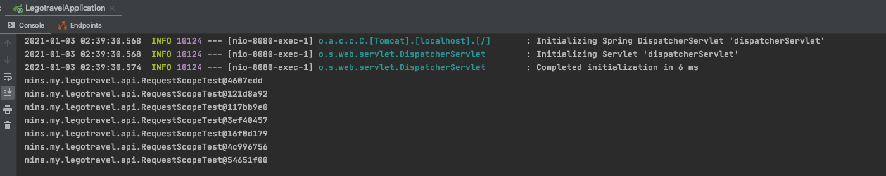
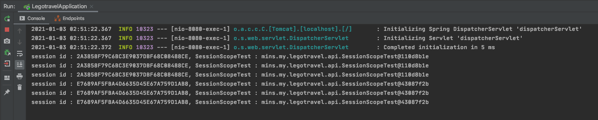

# Spring Core Study

- Reference Document
    1. https://docs.spring.io/spring-framework/docs/current/reference/html/core.html#beans
    
    
# About Web Scope
| Request Scope

```` 
@Controller
@RequestScope
@RequestMapping("/v1/api/beanScope")
@RequiredArgsConstructor
public class RequestScopeTest {

    private final ApplicationContext applicationContext;

    @GetMapping
    @ResponseBody
    public String test() {
        RequestScopeTest requestScopeTest = applicationContext.getBean("requestScopeTest", RequestScopeTest.class);
        System.out.println(requestScopeTest.toString());
        return "Request Scope";
    }
}
````
Console)




| Session Scope
````
@SessionScope
@RestController
@RequiredArgsConstructor
@RequestMapping("/v1/api/sessionScope")
public class SessionScopeTest {

    private final ApplicationContext applicationContext;

    @GetMapping
    public String test(HttpServletRequest request) {
        SessionScopeTest requestScopeTest = applicationContext.getBean("sessionScopeTest", SessionScopeTest.class);
        System.out.println("session id : " + request.getSession().getId() + ", SessionScopeTest : " + requestScopeTest.toString());
        return "Session Scope";
    }
}
````

Console)



//TODO Websocket Scope


| Application Scope

````
@ApplicationScope
@RestController
@RequiredArgsConstructor
@RequestMapping("/v1/api/applicationScope")
public class ApplicationScopeTest {

    private final ApplicationContext applicationContext;
    private static Integer counter = 0;

    private final WebApplicationContext webApplicationContext;

    @GetMapping
    public String test() {
        ApplicationScopeTest requestScopeTest = applicationContext.getBean("applicationScopeTest", ApplicationScopeTest.class);
        System.out.println(requestScopeTest.toString());

        if(counter++ >= 5) {
            webApplicationContext.getServletContext();
            //TODO Servlet 만 destroy 를 하고... 다시 startUp을 하면??!
        }

        return "Application Scope";
    }
}
````

This is somewhat similar to a Spring singleton bean but differs in two important ways: 
It is a singleton per ServletContext, not per Spring 'ApplicationContext' (for which there may be several in any given web application), and it is actually exposed and therefore visible as a ServletContext attribute.

-> TODO Servlet 을 reload 하면 Singleton Object가 새로 생길 거 같음(Spring Context는 유지한 체로..) 예제 코드 고민해 보기